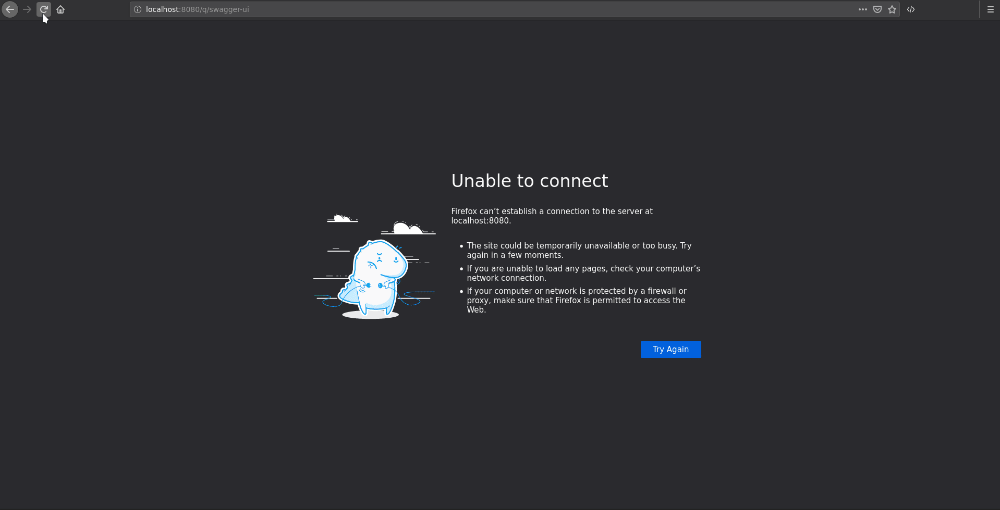

# OpenAPI Security : OAuth2

## Keycloak 
Download keycloak 12.0.3 and start with:

```
./bin/standalone.sh -Djboss.http.port=8081
```

* Import `oauth2-keycloak-setup.json`
** This creates the relevant client (quarkus-oauth2-client) and groups and roles.
* Create some users
** Under Manage>Users>Add user
*** dilbert:dilbert and join the employeeGroup
*** boss:boss and join the employeeGroup and the bossGroup

## In Swagger UI

* flow = implicit
* client id = quarkus-oauth2-client
* client secret = 1374b313-0f72-472d-a252-f50e4db816aa

