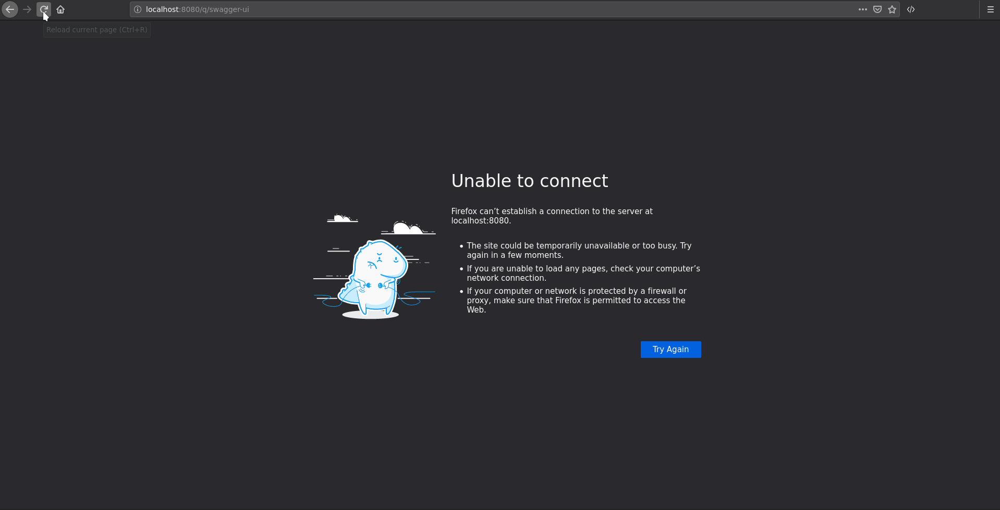

# OpenAPI Security : OIDC

## Keycloak 
Download keycloak 12.0.3 and start with:

```
./bin/standalone.sh -Djboss.http.port=8081
```

* Import `oidc-keycloak-setup.json`
    * This creates the relevant client (quarkus-oidc-client) and groups and roles.
* Create some users
    * Under Manage>Users>Add user
        * dilbert:dilbert and join the employeeGroup
        * boss:boss and join the employeeGroup and the bossGroup

## In Swagger UI

* flow = password
* client id = quarkus-oidc-client
* client secret = e7f3d8f6-a02c-4559-9837-13e3d215c3cf


